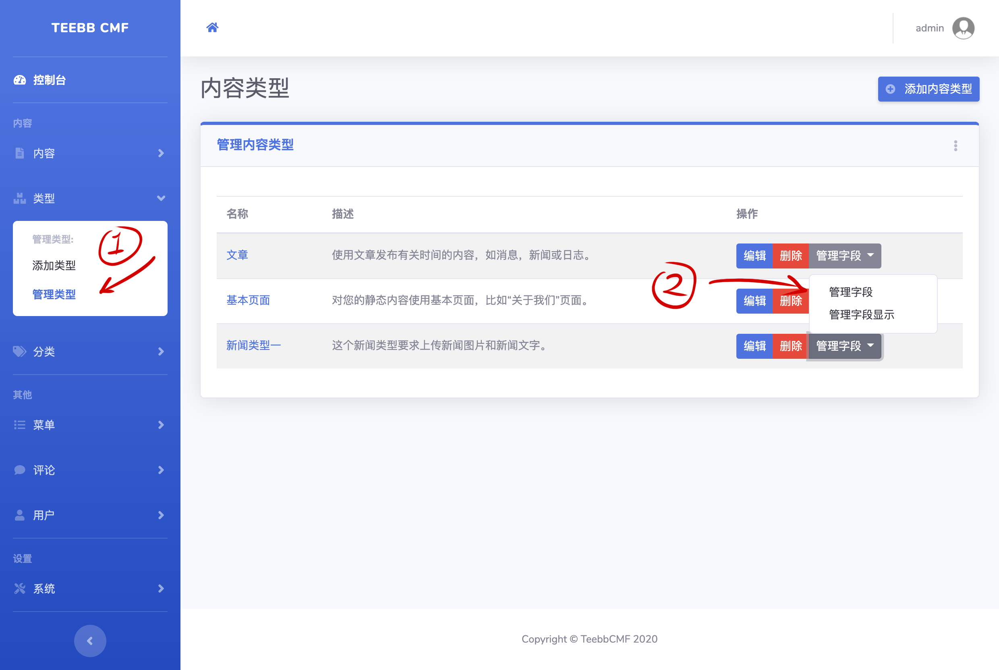
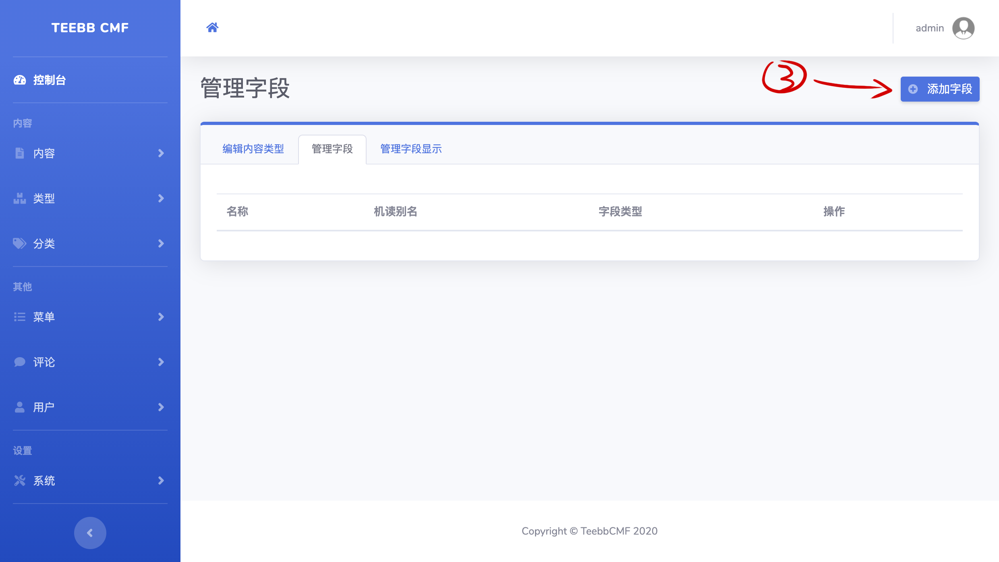
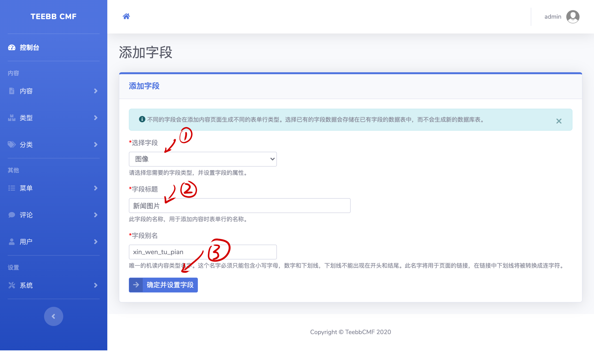
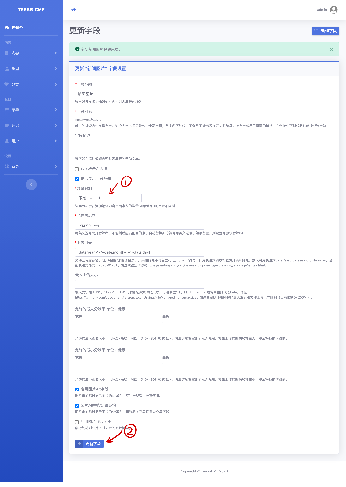

####3.2 字段

#####3.2.1 TEEBB中的内置字段
TEEBB内置了多个字段，现将各字段用途作如下介绍：  
常规类型：   
    - 链接：该字段会在创建内容时添加链接设置表单，在前台页面会生成对应超链接，可用于在内容中引用外部链接。  
    - 日期：该字段在会创建内容时添加日期设置表单，在前台页面显示日期值，并可使用此值做内容过滤。  
    - 布尔值：该字段在创建内容时添加两个预设值，可根据预设值做内容过滤。  
    - 评论：在内容显示页面底部生成评论显示及添加评论表单。  
    - 邮件地址：在创建内容时输入邮件地址。  
文本类型：  
    - 文本：基本的255字符长度文本，不过滤html标签。  
    - 文本、已格式化： 基本的255字符长度文本，使用过滤器过滤html标签。  
    - 长文本：使用textarea标签输入的不限长度文本，不过滤html标签。  
    - 长文本、已格式化：使用textarea标签输入的不限长度文本，使用过滤器过滤html标签。 
    - 长文本、已格式化带摘要：使用textarea标签输入的不限长度文本，使用过滤器过滤html标签，并带内容摘要框，如果摘要框为空则在提交内容时自动生成摘要。  
数值类型：  
    - 小数：数据库中以DECIMAL格式(精度根据字段设置)存储的小数。  
    - 浮点数：在数据库中以FLOAT类型存储。  
    - 浮点数列表：根据预设的浮点值列表，在添加内容时选择一个或多个值，并在前台显示此值。  
    - 整数：在Mysql数据库中以INT（11）类型存储。  
    - 整数列表：根据预设的整数值列表，在添加内容时选择一个或多个值，并在前台显示此值。  
引用类型：  
    - 文件：用于文件上传，可设置文件上传大小、文件后缀等，在前台则显示文件链接。  
    - 分类：用于引用分类词汇对内容进行分类。  
    - 内容：引用其他站内内容，常见的相关文章可使用此字段。  
    - 用户：引用站内其他用户。（0.1.0版本暂未实现）  
    - 图像：类似于文件上传，仅可上传图像类型，并可图像文件大小、文件后缀等。在前台显示图像。  

现在我们给”新闻类型一“内容类型添加字段。  
如果您在上一步点击了“保存并添加字段“按钮，您将直接进入添加字段页面。也可以在“管理类型”-> “管理字段”->“添加字段”，给对应的类型添加字段，如下图：  
  

  

我们的“新闻类型一”需要标题、主体（Body）、图片三个字段，我们可以使用内容bundle自带的标题，只需要添加新闻主体、图像字段即可。  
下图我们首先设置好图像字段的标题并点击下方按钮进入字段设置页面： 
  

#####3.2.2 TEEBB中常用字段的设置
TEEBB中不同类型的字段有不同的设置，通用部分有：  
字段的标题：用于在添加内容表单或前台显示的字段标题。  
别名：用于获取字段的值或在URL中显示，此值必须唯一。  
字段的描述：简短描述字段的用途，用于添加内容表单行的帮助文本。  
数量限制：可设置字段表单的数量，也可设置为不限制。  
是否显示字段标题：用于在前台内容显示时，是否显示当前字段的标题。  

现在，我们对前文新闻图片字段进行设置，我们可能需要上传多张图片，则可以在下图设置字段数量或修改为不限制，其他设置按照默认即可，设置完成点击“更新字段“按钮：  
   

对于新闻主体（Body），我们可以使用“长文本、已格式化带摘要”字段。按照上述步骤添加新闻主体字段，字段设置按照默认设置即可。  
> 字段设置一定要点击"更新字段"按钮，在此步骤TEEBB将为每个字段单独创建一张数据库表。否则将出现数据存储问题。

