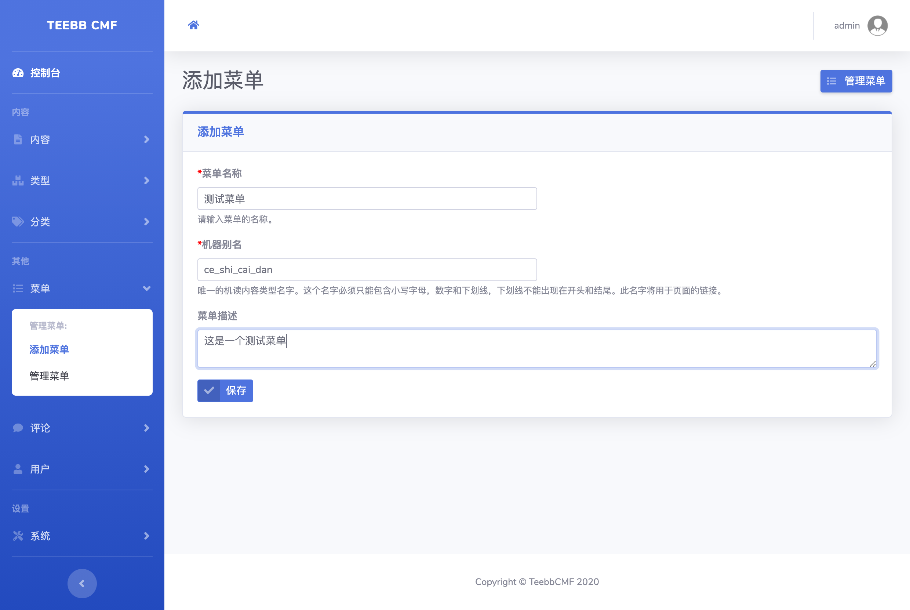
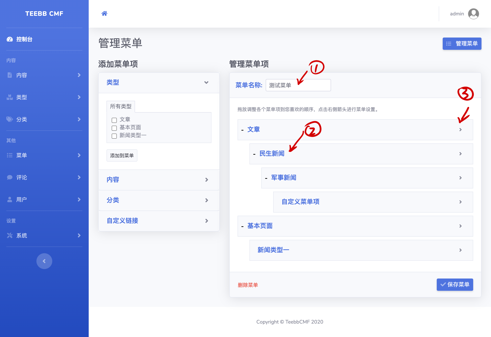

####3.7 菜单系统
菜单系统是我的最爱，虽然通常一个网站用到菜单不多，但我仍花了些心思在菜单上以使菜单能够更加灵活。菜单系统的设计参考了wordpress的菜单。   
菜单功能的实现使用了KnpMenuBundle，这个bundle功能很全面，是做菜单系统的首选。  

#####3.7.1 创建第一个菜单
点击“菜单”->“添加菜单”->输入菜单名、菜单别名、菜单描述->保存。和其他的别名一样，菜单别名也必须唯一，后期展示菜单时将用到菜单别名。  
  

点击“菜单”->“管理菜单”->选择对应菜单“管理菜单项”，将进入菜单项编辑页面。
  
选择左侧菜单项点击“添加到菜单”即可将菜单项添加到菜单。  
1号标记：可以对菜单名称进行修改，但菜单别名不会修改。  
2号标记：鼠标放置在菜单项时会呈现“十字箭头”，可拖动菜单项实现菜单项的顺序和父子关系调整。  
3号标记：可以对菜单项链接名称进行调整。  
最后记得点击“保存菜单“按钮。这一步很关键。：）

#####3.7.2 菜单的显示
我们的菜单系统使用了KnpMenuBundle，我们使用KnpMenuBundle的Twig函数来显示菜单。  
```twig
{#此处“demo“换成我们的菜单别名即可。#}
{{ knp_menu_render('demo') }} 
```
  

如果你需要使用自己的菜单模板管理菜单的显示，可以给knp_menu_render方法添加template参数。我们的边栏菜单便使用了模板。  
```twig
{{ knp_menu_render('demo', {template: 'template.html.twig'}) }}
```
更多的使用方法请参考KnpMenuBundle文档。https://symfony.com/doc/current/bundles/KnpMenuBundle/index.html

